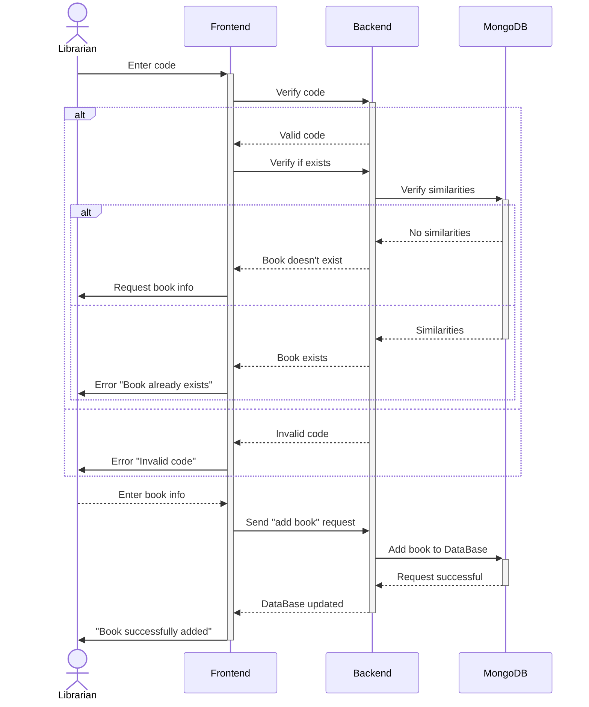
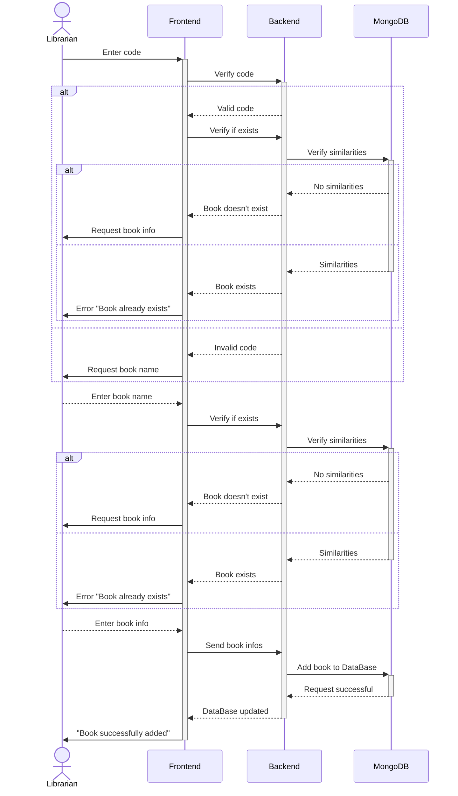

## Introduction to the Modification of the Book Management System

Our proposed modification to the book management system simplifies the addition process by introducing a key condition. Now, when entering an ISBN code, instead of immediately generating an error, the system **prompts the user to provide an associated title**. This strategic modification allows the system to switch to title-based searches rather than relying solely on the ISBN, thus avoiding obstacles caused by the absence of the latter, particularly for older books. We believe this solution offers a more flexible and intuitive approach while preserving the integrity of our database. Before implementing this change, we seek your feedback to ensure its effectiveness and acceptance by the team.

### Sequence Diagram: Current

### Sequence Diagram: Proposed

